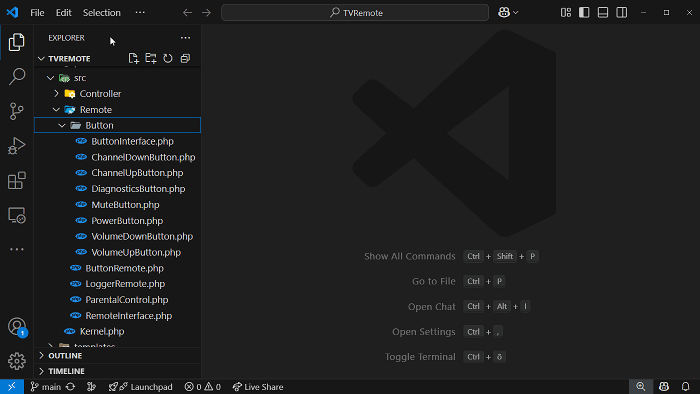
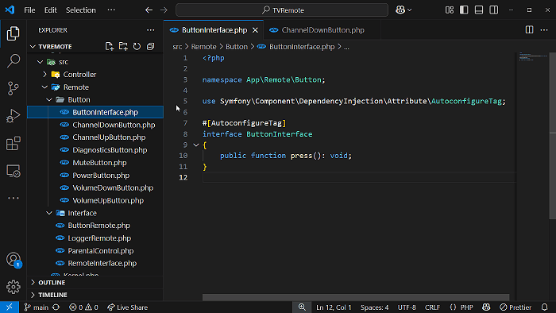
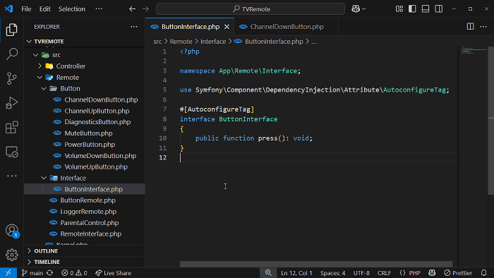

# PHP Smart Files

<div align="center">

[](https://marketplace.visualstudio.com/items?itemName=everstorm.php-smart-files)
[](https://opensource.org/licenses/MIT)

### Smart PHP File Creation & Intelligent Namespace Management

Create PHP files effortlessly with smart templates and automated namespace management for safe PSR-4 refactoring and consistent references.<br />
**Simplify your PHP development!**

</div>

## Key Benefits
- 📁 **Simplified Creation**: One-click PHP file creation with smart templates and proper namespaces
- 🔄 **Safe Refactoring**: Move, rename, and restructure without breaking namespace references
- 🧩 **Developer-Focused**: Built for real PHP workflows with practical features and sensible defaults
- 🌍 **Accessible**: Available in five languages with clear, customizable settings

## Table of Contents
- [Features](#features)
- [Usage](#usage)
- [Extension Settings](#extension-settings)
- [Available Languages](#available-languages)
- [About This Project](#about-this-project)
- [Release Notes](#release-notes)
- [Current Limitations](#current-limitations)
- [Feedback and Contributions](#feedback-and-contributions)
- [License](#license)

## Features

PHP Smart Files extends VS Code to enhance your PHP development workflow through automated file creation and intelligent namespace management:

### 🚀 Smart PHP File Creation

Create PHP files with auto-detected namespaces based on your project's Composer configuration:

- **File Types**: Classes, interfaces, traits, and enums
- **Automatic Namespaces**: Intelligently follows PSR-4 standards from composer.json with optional fallback to directory structure
- **Template Options**:
  - Basic empty files
  - Pre-populated templates with boilerplate code
  - Specialized Symfony templates (Controllers, Commands, Form Types)
- **Context Menu Integration**: Right-click in the explorer to create PHP files

> 💡 **Tip:** You can enable strict type declarations (`declare(strict_types=1);`) for all generated files through the extension settings

<br />
*__Demo__: Creating a PHP class from template with automatic namespace detection*

### 🔄 Intelligent Namespace Refactoring

Save time and prevent bugs with comprehensive namespace management:

- **File Operations**:
  - Move files: Automatically adjust namespaces and all references
  - Rename files: Update class/interface/trait/enum names and all references
  - Manage directories: Refactor all files within moved/renamed directories
- **Smart Use Statement Management**:
  - Adds missing use statements when needed
  - Removes redundant use statements when files share namespace
  - Updates fully qualified and partially qualified namespace references
  - Supports use statements with aliases
- **Efficient Processing**: Handles reference updates in parallel for better performance
- **Flexible Configuration**: Control refactoring behavior for each operation type
- **Format Integrity**: Preserves your preferred line break style (CR, LF, CRLF) during all file operations

<br />
*__Demo__: Moving a PHP file with automatic namespace and reference updates*


<br />
*__Demo__: Renaming a PHP file with automatic definition and reference updates*

## Usage

### Creating PHP Files

Right-click in the Explorer and select from the "Create PHP File" submenu:

#### Basic Files
- **Empty PHP File**: Creates a basic PHP file with namespace
- **Empty PHP Class**: Creates a PHP class with namespace and class declaration
- **Empty PHP Interface**: Creates a PHP interface with namespace
- **Empty PHP Enum**: Creates a PHP 8.1+ enum with namespace
- **Empty PHP Trait**: Creates a PHP trait with namespace

#### Template Files
- **PHP Class with Template**: Creates a PHP class with helpful boilerplate code
- **PHP Interface with Template**: Creates a PHP interface with method templates
- **PHP Enum with Template**: Creates a PHP enum with case examples
- **PHP Trait with Template**: Creates a PHP trait with method examples

#### Symfony Templates
- **Symfony Controller**: Creates a controller with route attributes and render method
- **Symfony Command**: Creates a command with complete structure following Symfony console conventions
- **Symfony Form Type**: Creates a form type with buildForm and configureOptions methods

All created files automatically detect the proper namespace based on your project's PSR-4 configuration in composer.json or (when enabled) fall back to an intelligent directory-based namespace structure.

### Namespace Refactoring

The extension automatically refactors namespaces and references during standard file operations:

- Simply **move files** between directories or **rename files** in your editor or file explorer
- When prompted, confirm the refactoring operation (if using default settings)
- That's it! The extension handles all namespace updates, class renames, and reference adjustments

> 💡 **Tip:** Use the extension settings to control whether confirmations are shown or to disable specific refactoring features

## Extension Settings

All settings can be configured through VS Code settings (Gear icon → Extensions → PHP Smart Files) or in your settings.json file.

| Setting | Description | Default |
|---------|-------------|---------|
| `phpSmartFiles.useStrictTypeInTemplates` | Include `declare(strict_types=1);` in generated files | `false` |
| `phpSmartFiles.useFallbackNamespace` | Use fallback namespace when no namespace could be resolved | `false` |
| `phpSmartFiles.fallbackNamespace` | Base namespace for fallback (builds namespace based on file location) | `App` |
| `phpSmartFiles.refactorNamespacesOnFileMoved` | Control behavior when files are moved<br>- `confirm`: Prompt for confirmation<br>- `always`: Automatically refactor<br>- `never`: Disable feature | `confirm` |
| `phpSmartFiles.refactorNamespacesOnFileRenamed` | Control behavior when files are renamed (same options as `refactorNamespacesOnFileMoved`) | `confirm` |
| `phpSmartFiles.refactorNamespacesOnDirectoryChanges` | Control behavior when directories are moved or renamed (same options as `refactorNamespacesOnFileMoved`) | `confirm` |
| `phpSmartFiles.refactorNamespacesExcludeDirectories` | Directories to exclude when searching for references | Common directories like `vendor`, `node_modules`, etc. |

## Available Languages

This extension is available in multiple languages:
- English
- German (Deutsch)
- French (Français)
- Spanish (Español)
- Russian (Русский)

## About This Project

### 🌱 Project Origins

PHP Smart Files began as a personal project to simplify my own development workflow. Initially created as a simple tool for generating correctly namespaced PHP files, it has grown into a comprehensive solution, driven by evolving requirements and continuous feature enhancements.

Looking back, it's nice to see how far this project has come. The files actually became "smart" along the way - handling namespaces and refactoring automatically, which saves a lot of manual work I used to do.

### 🧰 Development & Maintenance

I maintain this extension in my spare time alongside a full-time job and other responsibilities. While I'm committed to its quality and stability, it's important to set realistic expectations:

- Bug fixes and critical issues are prioritized
- Feature requests are evaluated based on community interest and implementation complexity
- Response times may vary depending on my availability

I'll do my best to keep this extension reliable and useful while balancing its scope with available time.

## Release Notes

### Current Version: 1.0.2

This version includes improvements for the Visual Studio Marketplace:
- Optimized extension logo and gallery banner
- Enhanced extension description, keywords, and README for better discoverability and presentation

### Version: 1.0.1

This version includes updates to the README documentation:
- Improved formatting for better readability
- Removed badges that were not functioning correctly
- Revised "Project Origins" section

### Version: 1.0.0

This version marks the official release of the "PHP Smart Files" extension:
- Comprehensive support for PHP file creation, namespace refactoring, and directory operations
- Multi-language support (English, German, French, Spanish, Russian)
- Integration with VS Code Explorer context menu for seamless file operations
- Intelligent handling of PHP namespaces, including partially qualified references
- Advanced refactoring capabilities for files, directories, and namespaces
- Enhanced performance and stability for large-scale refactoring operations
- Improved user feedback with localized messages and progress indicators

For a detailed list of changes in this and previous versions, please see the [CHANGELOG](CHANGELOG.md).

## Current Limitations

### Grouped Namespace Statements

The current version doesn't support grouped use statements in namespace refactoring:

```php
// Not fully supported yet:
use MyNamespace\{ClassA, ClassB as B, SubNamespace\ClassC};
```

When using this PHP syntax feature, refactoring operations may be incomplete or require manual adjustments. Support for grouped namespace statements is planned for future releases. If this feature is important to your workflow, please see the "Feedback and Contributions" section below and let me know.

### Function and Constant Imports

The extension currently doesn't fully support refactoring of imported functions or constants:

```php
// Not supported yet:
use function App\Utils\someFunction;
use const App\Config\SOME_CONSTANT;
```

When using these import types, namespace references will not be updated during refactoring operations. Support for function and constant imports is planned for the next release and is the top priority in the development roadmap.

## Feedback and Contributions

Your feedback, ideas, and contributions are truly appreciated! If you've found a bug, have a suggestion, or want to contribute:

- [Submit an issue](https://github.com/EverstormDevelopment/vscode-extension-php-smart-files/issues)
- [Contribute on GitHub](https://github.com/EverstormDevelopment/vscode-extension-php-smart-files)

Thanks for helping make PHP Smart Files better!

## License

This extension is licensed under the [MIT License](LICENSE).

---

**Enjoying PHP Smart Files?** Consider [rating it](https://marketplace.visualstudio.com/items?itemName=everstorm.php-smart-files) in the VS Code Marketplace!
